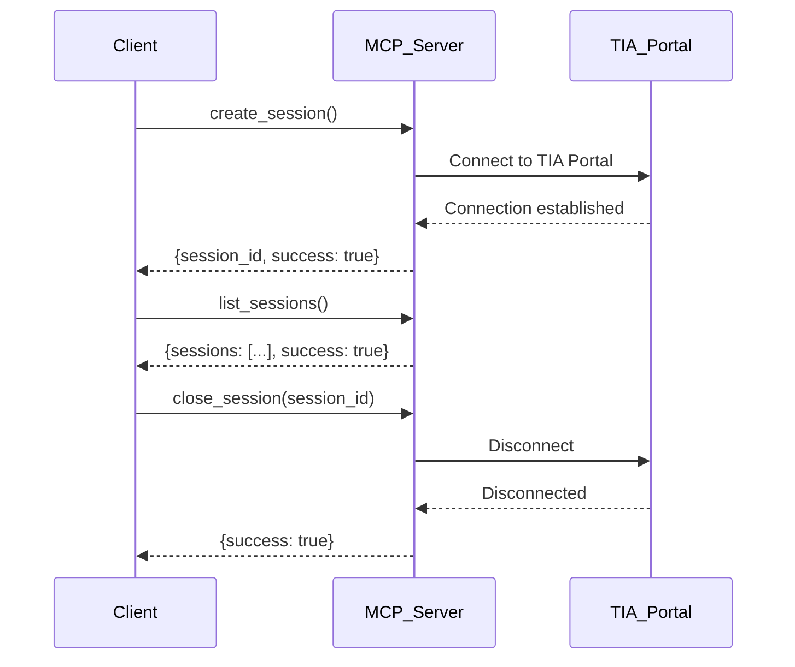
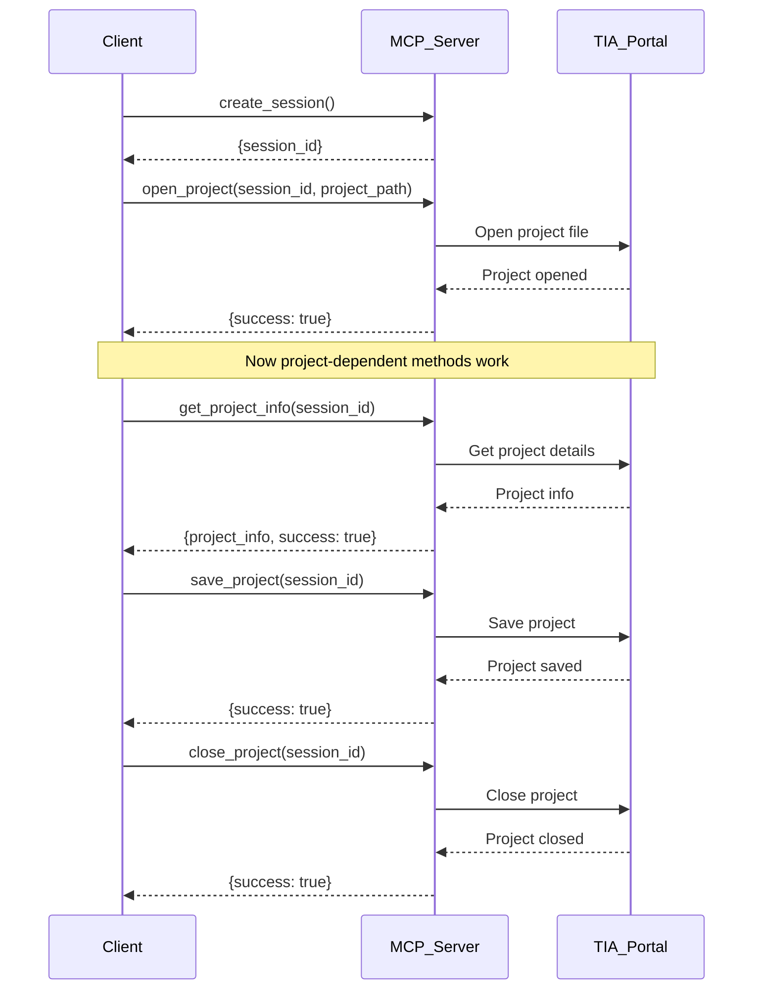
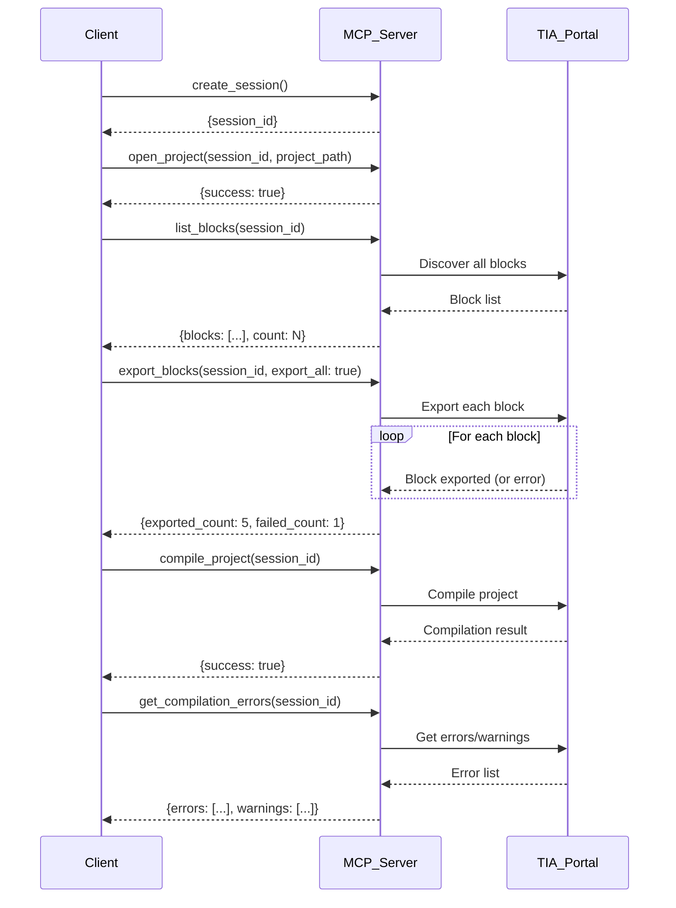
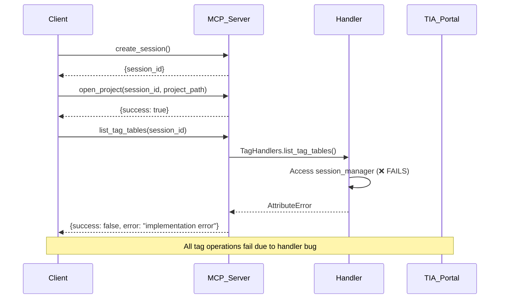
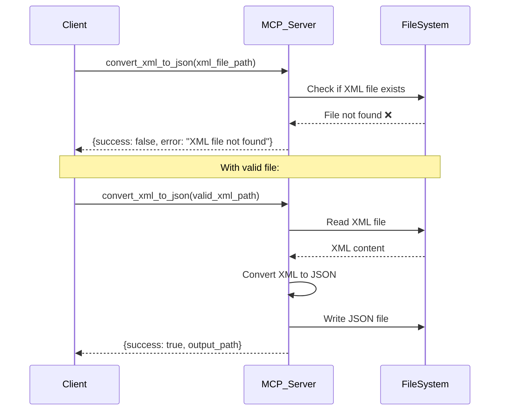
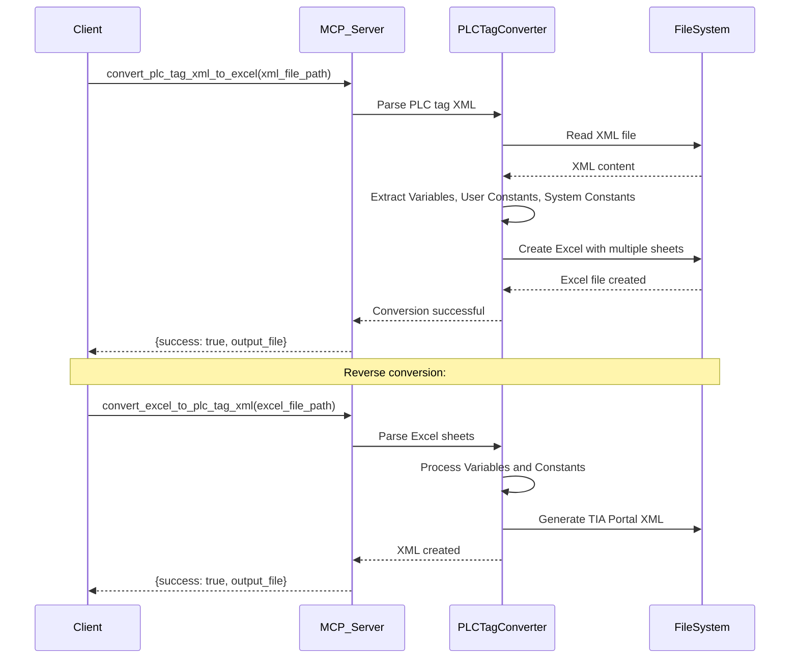
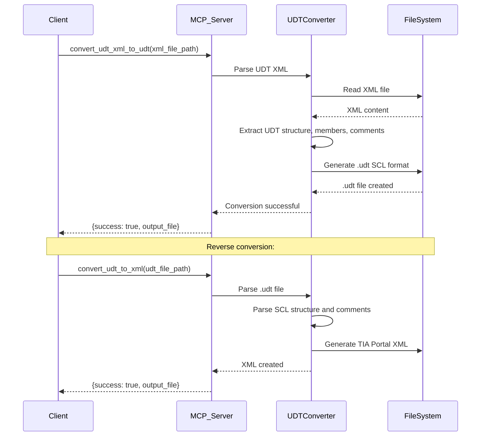
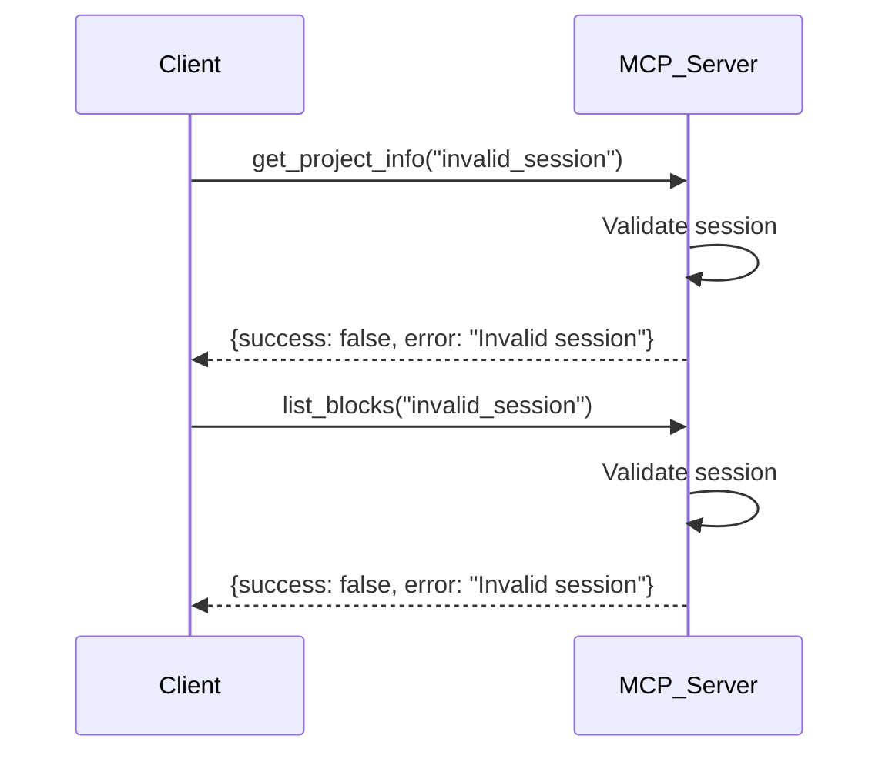
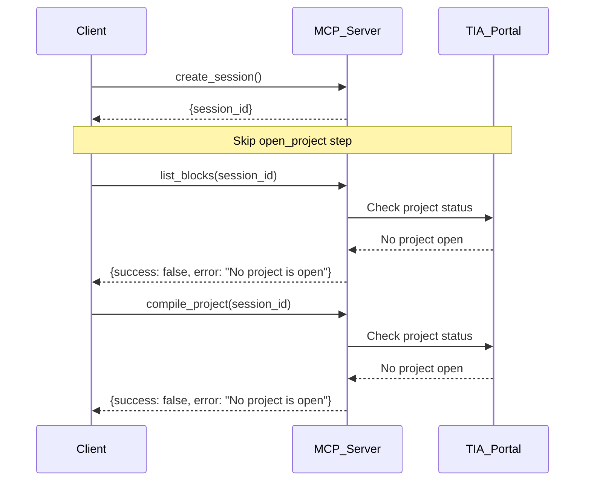

# TIA Portal MCP Server - Call Sequence Diagrams

## Method Dependency Tree

```
Level 0: No Dependencies
├── list_sessions ✅
├── create_session ✅  
└── File Conversions (require valid file paths)
    ├── convert_xml_to_json
    ├── convert_json_to_xml
    ├── convert_json_to_scl
    ├── convert_scl_to_json
    ├── convert_xml_to_scl
    ├── convert_scl_to_xml
    ├── convert_plc_tag_xml_to_excel
    ├── convert_excel_to_plc_tag_xml
    ├── convert_udt_xml_to_udt
    └── convert_udt_to_xml

Level 1: Session Required
├── create_session ✅
│   ├── open_project ✅
│   ├── close_project ✅
│   └── close_session ✅

Level 2: Session + Project Required  
├── create_session ✅
│   └── open_project ✅
│       ├── get_project_info ❓
│       ├── save_project ❓
│       ├── list_blocks ✅
│       ├── compile_project ✅
│       └── get_compilation_errors ✅

Level 3: Session + Project + Data Required
├── create_session ✅
│   └── open_project ✅
│       ├── list_blocks ✅
│       │   └── export_blocks ✅ (5/6 success)
│       ├── list_tag_tables ❌ (broken)
│       │   ├── export_all_tag_tables ❌ (broken)
│       │   └── get_tag_table_details ❌ (broken)
│       └── discover_all_udts ❓
│           ├── export_all_udts ❓
│           ├── export_specific_udts ❓
│           └── generate_udt_source ❓
```

## Sequential Call Flow Diagrams

### 1. Basic Session Management



### 2. Project Operations Flow



### 3. Block Operations Flow



### 4. Failed Tag Operations Flow (Broken Implementation)



### 5. File Conversion Flow (Independent)



### 6. PLC Tag Conversion Flow (New)



### 7. UDT Conversion Flow (New)



## Error Flow Diagrams

### 1. Invalid Session Error



### 2. No Project Open Error



## Method Success/Failure Matrix

| Method | No Session | Invalid Session | Session Only | Session + Project | Notes |
|--------|-----------|-----------------|--------------|------------------|-------|
| `list_sessions` | ✅ | ✅ | ✅ | ✅ | Always works |
| `create_session` | ✅ | ✅ | ✅ | ✅ | Always works |
| `close_session` | ❌ | ❌ | ✅ | ✅ | Needs valid session |
| `open_project` | ❌ | ❌ | ✅ | ✅ | Needs valid session + path |
| `close_project` | ❌ | ❌ | ✅ | ✅ | Works even without project |
| `get_project_info` | ❌ | ❌ | ❌ | ❓ | Needs open project |
| `save_project` | ❌ | ❌ | ❌ | ❓ | Needs open project |
| `list_blocks` | ❌ | ❌ | ❌ | ✅ | Needs open project |
| `export_blocks` | ❌ | ❌ | ❌ | ✅ | Needs open project + blocks |
| `compile_project` | ❌ | ❌ | ❌ | ✅ | Needs open project |
| `get_compilation_errors` | ❌ | ❌ | ❌ | ✅ | Needs open project |
| `list_tag_tables` | ❌ | ❌ | ❌ | ❌ | Handler bug |
| File conversions | ✅* | ✅* | ✅* | ✅* | *Needs valid file paths |
| PLC tag conversions | ✅* | ✅* | ✅* | ✅* | *Needs valid XML/Excel files |
| UDT conversions | ✅* | ✅* | ✅* | ✅* | *Needs valid XML/.udt files |

## Critical Call Sequences

### ✅ Working Sequences

1. **Basic Session Management**:
   ```
   create_session() → list_sessions() → close_session()
   ```

2. **Project Access**:
   ```
   create_session() → open_project() → close_project()
   ```

3. **Block Operations**:
   ```
   create_session() → open_project() → list_blocks() → export_blocks()
   ```

4. **Compilation Workflow**:
   ```
   create_session() → open_project() → compile_project() → get_compilation_errors()
   ```

### ❌ Failing Sequences

1. **Skip Session Creation**:
   ```
   list_blocks() ❌ → Error: Invalid session
   ```

2. **Skip Project Opening**:
   ```
   create_session() → list_blocks() ❌ → Error: No project open
   ```

3. **Tag Operations** (due to implementation bug):
   ```
   create_session() → open_project() → list_tag_tables() ❌ → Handler error
   ```

## Dependency Chain Summary

```
Level 0 (Independent)
├── list_sessions
├── create_session  
└── convert_* (with valid files)
    ├── PLC tag conversions (XML ↔ Excel)
    └── UDT conversions (XML ↔ .udt)

Level 1 (Requires Session)
├── create_session ──┐
│                   └── open_project
│                   └── close_project  
│                   └── close_session

Level 2 (Requires Session + Project)  
├── create_session ──┐
│                   └── open_project ──┐
│                                     ├── get_project_info
│                                     ├── save_project
│                                     ├── list_blocks
│                                     ├── compile_project
│                                     └── get_compilation_errors

Level 3 (Requires Session + Project + Data)
├── create_session ──┐
│                   └── open_project ──┐
│                                     └── list_blocks ──┐
│                                                       └── export_blocks
```

**Key Finding**: The dependency chain is linear - each level builds on the previous one, and breaking any link in the chain causes all downstream methods to fail with predictable error messages.